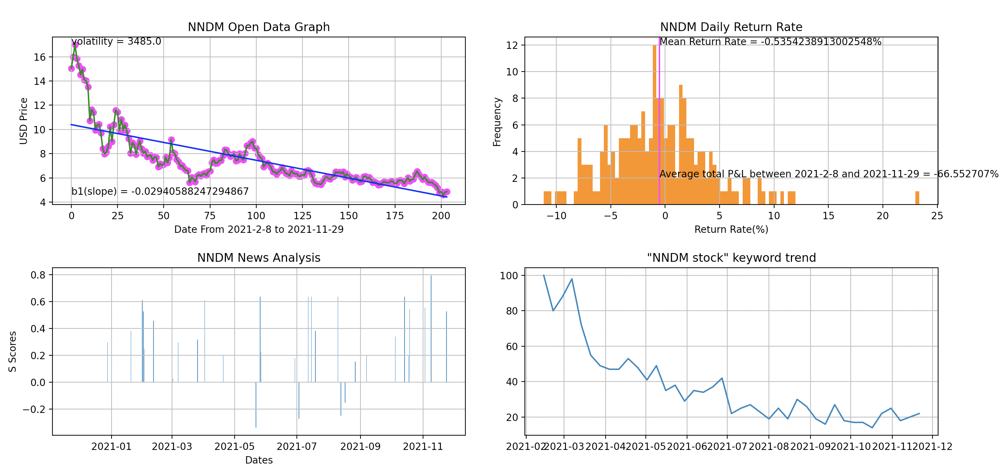
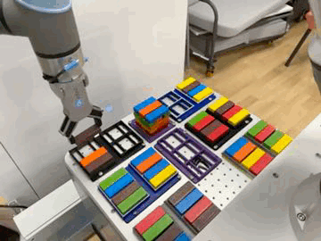
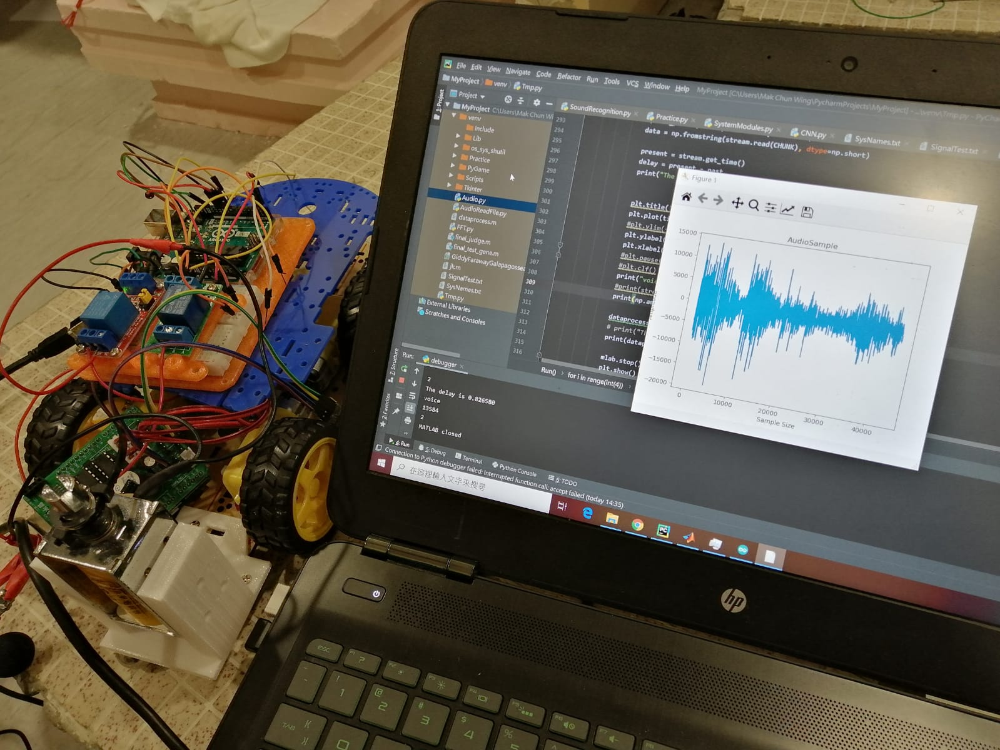
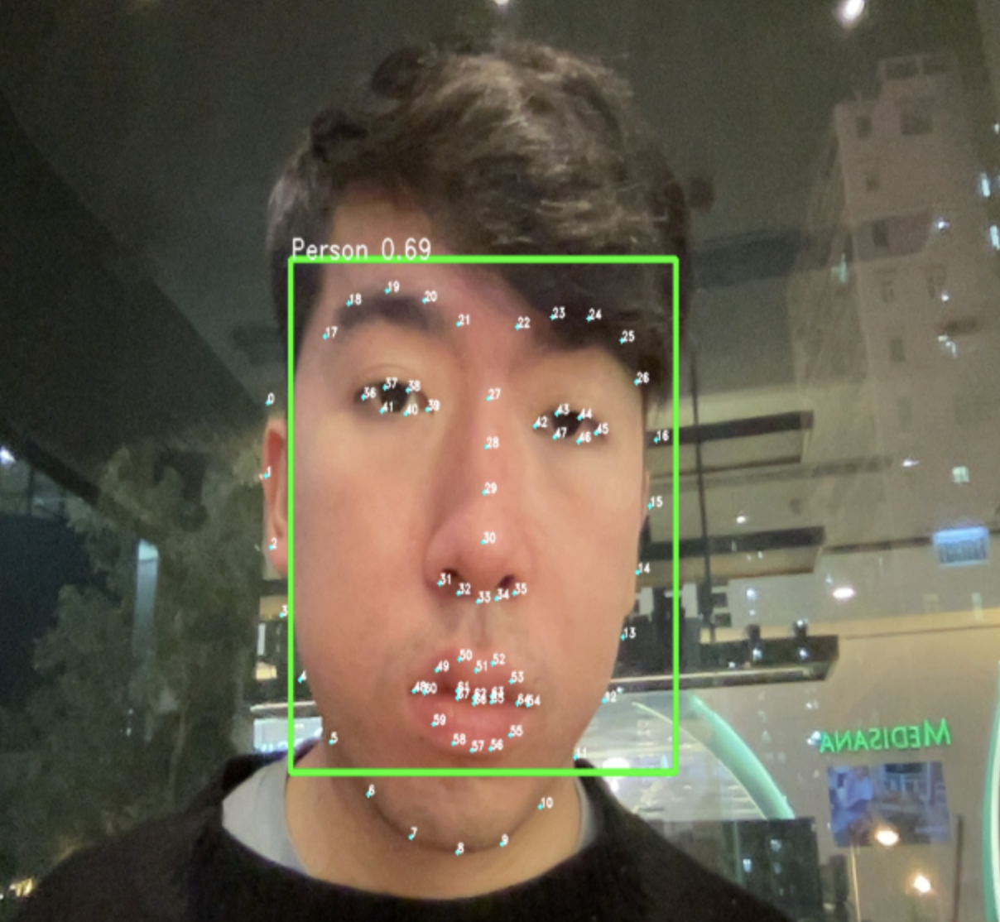
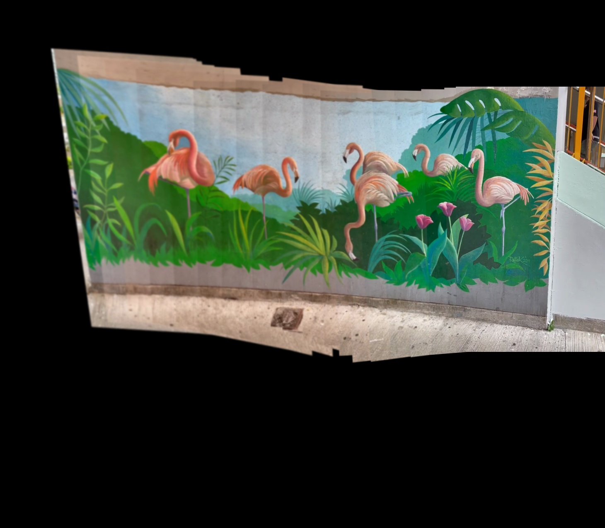
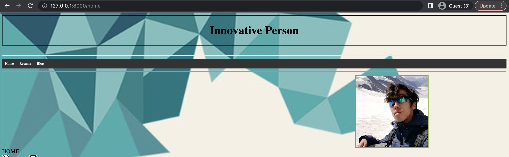
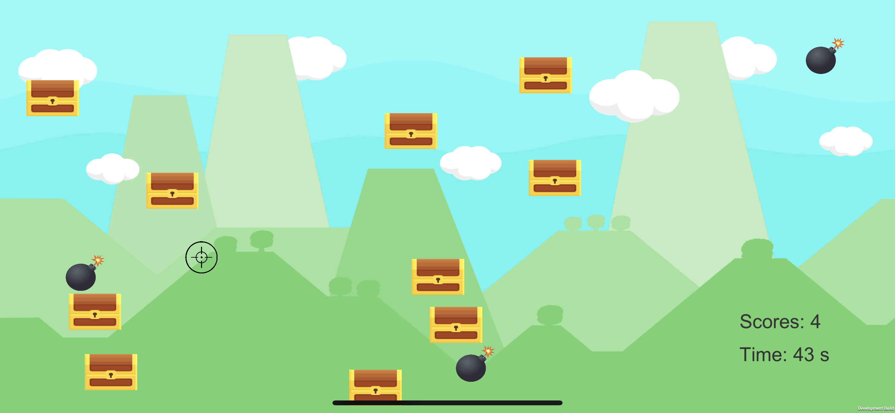

# Benny's Blog — Personal Portfolio
:clipboard: **Name:** _Mak Chun Wing, Benny_<br/>
<br/>
**Live site:** https://Mcc-Mak.github.io/blog/
React 19 + Vite blog introducing **Mak Chun Wing (Benny)** — IT project officer, ex-researcher, hobby developer. This README is the **toctree**: every project is grouped by category and links to its source in this repository.
**Role tags:** 🧑&#xFE0F; Personal · 🎓 Academic · 🔬 Research · 📚 Learning · 🧪 Open-source
---
## Trading & Fintech
Market dashboards, algorithmic trading and stock analysis tools.
- **[Automated Trading Robot](projects/trading/automated_trading_robot/)** · 🧑&#xFE0F; Personal — Algorithmic trading robot for HK/US markets; dashboard shows bot buy/sell advice points with running gain/loss and technical info. Run: `python stock_app.py` · [GitHub](https://github.com/chunwmak9/Automated_Trading_Robot)
- **[US Stock Scanner](projects/trading/us_stock_scanner/)** · 🧑&#xFE0F; Personal — Stock analyzer combining news sentiment analysis with statistical analysis of historical data. Run: `python stock_gui.py` · [GitHub](https://github.com/chunwmak9/US_Stock_Scanner)
  
## Robotics & Automation
Industrial robots, non-destructive testing and automation research.
- **[Jenga UR-10 Robot](projects/robotics/jenga_ur_robot/)** · 🎓 Academic — UR-10 stacks 18 layers of Jenga blocks in URScript using 3D-printed holders. [GitHub](https://github.com/chunwmak9/Jenga_UR_Robot)
  
- **[Tile Void NDT Robot](projects/robotics/sound_processing/)** · 🔬 Research — Non-destructive sound-impact test that classifies hollow/solid tile areas in ~1 s; bluetooth + Arduino robot platform. [GitHub](https://github.com/chunwmak9/SoundProcessing)
  
## Computer Vision & Media
Face landmark detection and image/video processing utilities.
- **[68-Point Face Detector](projects/computer_vision/face_point_detector_68/)** · 🎓 Academic — Face detector returning 68 facial landmark points (0–67). [GitHub](https://github.com/chunwmak9/face_point_detector_68)
  
- **[Image Processing Tools](projects/computer_vision/image_processing_tools/)** · 🧑&#xFE0F; Personal — Toolkit for video-to-panorama conversion, pixelation and more. [GitHub](https://github.com/chunwmak9/image_processing_tools)
  
## Embedded & IoT
ESP32 / M5Stack firmware and hardware experiments.
- **[M5Stack Firmware Fork](projects/embedded_iot/m5stack/)** · 🧪 Open-source — Fork of the official M5Stack (ESP32) Arduino library with a custom UHF RFID fix. [GitHub](https://github.com/chunwmak9/M5Stack)
## Web Development
Websites and web apps built with Python frameworks.
- **[Personal Web (Django)](projects/web/personal_web/)** · 🧑&#xFE0F; Personal — Django personal site with Home / Resume / Blog sections; an earlier generation of this blog. Run: `python django_web/manage.py runserver` (after `pip install django pillow`) · [GitHub](https://github.com/chunwmak9/Personal_web)
  
## Games
Desktop and mobile games built with Pygame and Unity.
- **[SkyWar](projects/games/skywar/)** · 🧑&#xFE0F; Personal — Sky shooting game in Pygame: dodge missiles or shoot back. Run: `python user_interface.py` · [GitHub](https://github.com/chunwmak9/SkyWar)
- **[Treasury Hunter (iOS)](projects/games/treasury_hunter_ios/)** · 🧑&#xFE0F; Personal — Unity gyro-controlled iOS game: hit treasure (+1), avoid bombs (−3), 60-second countdown. [GitHub](https://github.com/chunwmak9/Treasury_Hunter_IOS)
  
## Algorithms & Libraries
Algorithm implementations and reusable code libraries.
- **[Python Basic Algorithms](projects/algorithms/python_basic_algorithms/)** · 📚 Learning — Sorting, graph concepts/data structures and depth-first search. [GitHub](https://github.com/chunwmak9/Python_Basic_Algorithms)
---
## Blog app
| Path | Contents |
| --- | --- |
| `src/pages/home.jsx` | Resume / profile page |
| `src/pages/projects.jsx` | This project index, rendered as site cards |
| `src/data/projects.js` | **Single source of truth** for the project cards and tags above |
| `src/pages/gallery.jsx` | Accordion gallery parsed from `public/gallery.md` |
| `public/projects/<slug>/` | Showcase screenshots & demos (one folder per project slug) |
| `projects/<category>/<slug>/` | Project source code, grouped by category |
## Update and deploy
```sh
git add . && git commit -m "..." && git push origin dev-001
# dev-001 auto-merges to dev, then main (.github/workflows/auto_merge.yml)
npm run deploy   # builds and publishes dist/ to the gh-pages branch
```